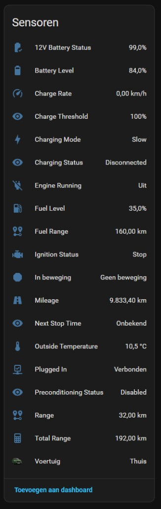
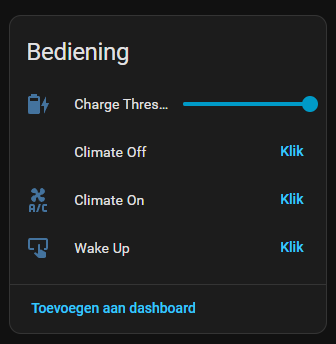
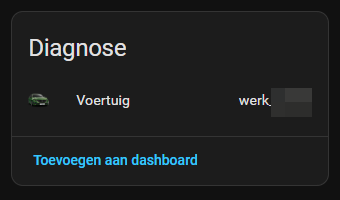

# 🚗 PSA Car controller for Home Assistant

Connect Home Assistant to **[psa_car_controller](https://github.com/flobz/psa_car_controller)** (thanks to [@flobz](https://github.com/flobz)). Poll vehicle status, control charging thresholds, preconditioning, wake-up, and show position on the map with an optional vehicle image.

---

## Table of contents

- [Features](#features)
- [Screenshots in Home Assistant](#screenshots-in-home-assistant)
- [Installation](#installation)
  - [HACS (recommended)](#hacs-recommended)
  - [Manual](#manual)
- [Initial setup](#initial-setup)
- [Entities overview](#entities-overview)
- [Vehicle image cache](#vehicle-image-cache)
- [Requirements](#requirements)
- [Links](#links)

---

## ✨ Features

| Area | What you get |
|------|----------------|
| **Sensors** | Battery, range, mileage, charging, climate, fuel (hybrid/ICE), temperature, thresholds, and more |
| **Controls** | Charge threshold slider, climate on/off, wake-up |
| **Map** | `device_tracker` with GPS from PSA data and optional `entity_picture` |
| **Config flow** | Host, VIN, brand, model, optional image URL — no YAML package required |

---

## 🖼️ Screenshots in Home Assistant

Lovelace **Entities** cards (dark theme; entity names follow your Home Assistant language).

**Sensors** — battery, range, charging, fuel, mileage, and related values:

**Controls** — charge threshold, climate on/off, wake-up:

**Diagnostics** — vehicle row with optional processed image:

---

## 📦 Installation

### HACS (recommended)

This integration is **not** in the default HACS store. Add it as a **custom repository**:

1. **HACS** → menu → **Custom repositories**
2. **Repository:** `https://github.com/nielseulink/ha_psa_controller`
3. **Category:** **Integration** → **Add**
4. Open the integration in HACS → **Download**
5. **Restart** Home Assistant

### Manual

1. Copy the folder `custom_components/psa_controller/` into `<config>/custom_components/`
2. Restart Home Assistant

---

## 🔧 Initial setup

1. Ensure **psa_car_controller** is running and reachable from Home Assistant (e.g. `http://192.168.0.100:5000`).
2. **Settings** → **Devices & services** → **Add integration** → **PSA Car controller**
3. Fill in:
   - **URL** — e.g. `http://192.168.0.100:5000`
   - **VIN** — from psa_car_controller logs/config (`cars.json`), or your manufacturer app / documents
   - **Brand** & **model** — used for the device name (includes VIN so two identical cars stay distinct)
   - **Vehicle image URL** (optional) — public image URL; stored under `www/ha_psa_car_controller/<VIN>_opt.png` after processing

---

## 📊 Entities overview

**Sensors (examples):** battery level, range, total range, mileage, charging status / mode / rate, charge threshold, next stop time, fuel level & range, outside temperature, 12V battery, ignition, preconditioning, etc.

**Binary sensors:** plugged in, position / moving, engine running.

**Other:** `device_tracker` (vehicle), **number** (charge threshold target), **buttons** (wake, climate on/off).

---

## 🖼️ Vehicle image cache

Optional URLs (e.g. manufacturer render PNGs) are downloaded and normalized to a **400×400** centered PNG (transparent padding), similar to other Stellantis-oriented integrations. Requires **Pillow** (declared in `manifest.json`).

To force a refresh, delete `www/ha_psa_car_controller/<VIN>_opt.png` and restart or reload the integration.

The integration **brand icon** in Home Assistant comes from `custom_components/psa_controller/brand/icon.png` ([psacc-ha](https://github.com/flobz/psacc-ha/blob/main/psacc-ha/logo.png) artwork).

---

## ✅ Requirements

- **Home Assistant** 2026.3+ recommended (local `brand/` assets in the HA UI)
- **Pillow** — installed automatically with the integration
- Running **[flobz/psa_car_controller](https://github.com/flobz/psa_car_controller)** reachable from Home Assistant

---

## 🔗 Links

| Resource | URL |
|----------|-----|
| This repository | [github.com/nielseulink/ha_psa_controller](https://github.com/nielseulink/ha_psa_controller) |
| Releases | [github.com/nielseulink/ha_psa_controller/releases](https://github.com/nielseulink/ha_psa_controller/releases) |
| Issues | [github.com/nielseulink/ha_psa_controller/issues](https://github.com/nielseulink/ha_psa_controller/issues) |
| Upstream PSA stack | [flobz/psa_car_controller](https://github.com/flobz/psa_car_controller) |
